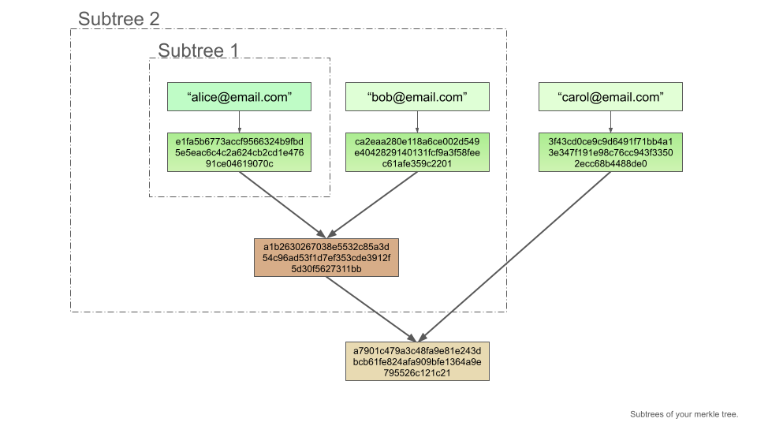
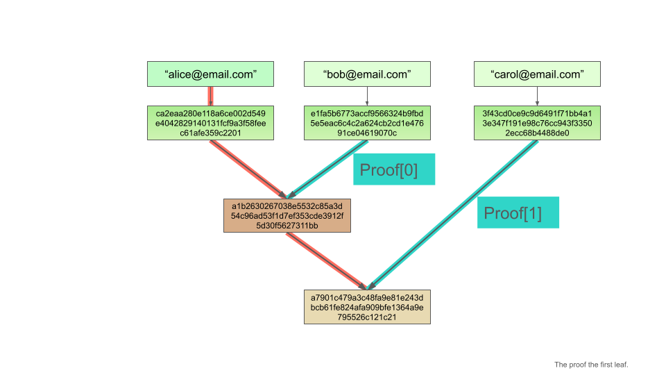

# A practical introduction into Merkle trees

Congratulations to your decision to learn about Merkle trees. They are a fundamental building block of blockchains, very useful for many different types of decentralized applications, and they are very easy to use.

In this tutorial, you will use the [Merkle tree library of Open Zeppelin](https://github.com/OpenZeppelin/merkle-tree). You will build a simple Merkle tree and test it with jest.

At the end of this tutorial:

- You will know how to create a Merkle tree.
- You will know how to use proofs to verify leafs.
- You will understand the concept of Merkle trees, how they are built, and why they are important.
- You will have had some fun learning a new technology.

## 1. Intro: Why are Merkle trees useful?

### Problem: Blockspace is expensive

As a developer new to blockchain technology, you will encounter many new concepts. While the syntax of Solidity looks similar to JS, some programming paradigms are fundamentally different on the blockchain, than on the centralized internet.

One main example is access control and verification. Let's say you'd wanted to grant access to a selected group of users, verified by their email. Coming from a centralized backend, you would store every verified email address in a database. When a user proofs she owns an email address, you would look up the email address in a database, check if it's verified, and than proceed accordingly.

That does not work on the blockchain.

Why?

- Because storage is very expensive on the blockchain. For every email address that you'd wanted to store on the blockchain, you would have to pay the gas fee for altering the state of the chain.

- Also, depending on the amount of addresses, you may have to use multiple transactions, so you would have to write a routine to make sure all transactions settle.

- And last but not least, every data on the chain is transparently visible. Different to a centralized backend, you cannot make sure that the data is private. Your users don't want to read their email address on the blockchain.

Enter Merkle trees. 🦾

### Solution: Merkle trees verify data efficiently

Merkle trees allow you to verify a (theoretically) infinite amount of data by storing only one hash on the blockchain.

The general idea of Merkle trees is to hash a value, and combine pairs of hashes together into one hash. The resulting hash is combined with another hash and hashed again. This procedure get's repeated as long as there is only one hash remaining, which is called the "root" of the Merkle tree. A Merkle tree thus consists of the leafs (the hashed of the data to verify, i.e. email addresses), the branches (the combined hashes of leafs and other branches), and the root (the final hash) of the Merkle tree.

In the next chapter, you will get an understanding of Merkle trees by building them.

## Build a Merkle tree

### Setup

Please clone this git repository and rum `npm install`. Make sure to use a node version >=20.0.0.

### Starting with the whole picture: A tree with tree leafs

We will start by creating a Merkle tree with three leafs. This will feel fast at the beginning. Please code along, as we will add more theory later, and you will understand everything fully at the end of this tutorial.

First, we will create the tree, by writing this into the file `src/01_three_leafs.ts`:

```ts
import { StandardMerkleTree } from "@openzeppelin/merkle-tree";

// We provide values as an array of arrays:
const values = [["alice@email.com"], ["bob@email.com"], ["carol@email.com"]];

// We have to provide the type of the values:
const types = ["string"];

// For this tutorial, we have to disable the automatic sorting of the leaves:
const options = { sortLeaves: false };

// Now we can create the tree:
export const tree = StandardMerkleTree.of(values, types, options);
```

Perfect. To inspect our tree, we use jest as a testing library. Write this into `test/1_three_leafs.test.ts`:

```ts
import { tree } from "../src/1_three_leafs";

test("1: three leafs", () => {
  console.log("This is the whole tree:\n", tree.render());
  console.log("This is the tree's root:\n", tree.root);

  expect(tree.root).toBe(
    "0xa7901c479a3c48fa9e81e243dbcb61fe824afa909bfe1364a9e795526c121c21"
  );
});
```

You can run this test with `npx jest -t "1: three leafs"`.

You will see this output:

```
PASS  test/1_three_leafs.test.ts
  ● Console

    console.log
      This is the whole tree:
      0) a7901c479a3c48fa9e81e243dbcb61fe824afa909bfe1364a9e795526c121c21
      ├─ 1) a1b2630267038e5532c85a3d54c96ad53f1d7ef353cde3912f5d30f5627311bb
      │  ├─ 3) e1fa5b6773accf9566324b9fbd5e5eac6c4c2a624cb2cd1e47691ce04619070c
      │  └─ 4) ca2eaa280e118a6ce002d549e4042829140131fcf9a3f58feec61afe359c2201
      └─ 2) 3f43cd0ce9c9d6491f71bb4a13e347f191e98c76cc943f33502ecc68b4488de0

      at Object.log (test/1_three_leafs.test.ts:5:13)

    console.log
      This is the tree's root:
      0xa7901c479a3c48fa9e81e243dbcb61fe824afa909bfe1364a9e795526c121c21

      at Object.log (test/1_three_leafs.test.ts:6:13)
```

Here is another image of our newly created Merkle tree.


You see:

1. The tree starts with the values.
2. The leafs are the hashes of the value.
3. There is only one branch, which hashes the first two leafs.
4. Finally, the root is a hash of the branch and the third leaf.

Well done.

In a next step, you will learn, how Merkle trees are composed, by creating two very small Merkle trees.

## The two subtrees

Let's now have a quick look at the two subtrees of our first Merkle tree. You will see, that Merkle trees are simple combinations of hashes.

Start by pasting this code into the file `src/2_subtrees.ts`:

```ts
import { StandardMerkleTree } from "@openzeppelin/merkle-tree";

// To keep this file short, we omit declaring variables and pass values and types directly to the `of` method.

// This tree will only have one leaf:
export const one_leaf_tree = StandardMerkleTree.of(
  [["alice@email.com"]],
  ["string"]
);

// And this tree will have two leafs:
export const two_leafs_tree = StandardMerkleTree.of(
  [["alice@email.com"], ["bob@email.com"]],
  ["string"],
  { sortLeaves: false }
);
```

You created two Merkle trees.

Let's inspect them in a test file `test/2_subtrees.test.ts`:

```ts
import { one_leaf_tree, two_leafs_tree } from "../src/2_subtrees";

test("2: subtrees", () => {
  console.log("This is the one leaf tree:\n", one_leaf_tree.render());
  console.log("This is the two leafs tree:\n", two_leafs_tree.render());

  expect(one_leaf_tree.root).toBe(
    "0xca2eaa280e118a6ce002d549e4042829140131fcf9a3f58feec61afe359c2201"
  );
  expect(two_leafs_tree.root).toBe(
    "0xa1b2630267038e5532c85a3d54c96ad53f1d7ef353cde3912f5d30f5627311bb"
  );
});
```

Run this test with `npx jest -t "2: subtrees"`. Your console will output this:

```
 PASS  test/2_subtrees.test.ts
  ● Console

    console.log
      This is the tree with one leaf:
       0) ca2eaa280e118a6ce002d549e4042829140131fcf9a3f58feec61afe359c2201

      at Object.log (test/2_subtrees.test.ts:4:11)

    console.log
      This is the tree with two trees:
       0) a1b2630267038e5532c85a3d54c96ad53f1d7ef353cde3912f5d30f5627311bb
      ├─ 1) e1fa5b6773accf9566324b9fbd5e5eac6c4c2a624cb2cd1e47691ce04619070c
      └─ 2) ca2eaa280e118a6ce002d549e4042829140131fcf9a3f58feec61afe359c2201

      at Object.log (test/2_subtrees.test.ts:5:11)
```

As you see, the leafs and hashes of the two subtrees are the same hashes we already know from our first tree with three leafs. This shows, how a Merkle tree is combining the hashes of its leafs and branches until only one root node is left. Each branch of a tree is the root of a subtree:



> The subtrees in our example require the option _sortLeaves_ to be false. Otherwise, the library will [order the leafs](https://github.com/OpenZeppelin/merkle-tree?tab=readme-ov-file#leaf-ordering) in order to make the Merkle tree more efficient on the blockchain.

Perfect, now you should have a decent understanding of how Merkle trees are created. In the next chapter you will learn how to use Merkle trees to verify data.

## Utilizing Merkle trees to verify data

In this chapter we will use our first Merkle tree with three leafs. We will learn about proofs and how to verify data with Merkle trees.

If we would use our Merkle tree in a real-world blockchain application, we would write only the root of the Merkle tree on the chain. Remember, that you can compose a Merkle tree of as many data points you want, so storing only the root is very efficient.

We now want to verify the user with the email address 'alice@email.com'. In order to verify this email address, we need the proof of this leaf. Let's do this in practice.

You don't have to create a new Merkle tree, only create a new test file under `test/3_verification_with_proof.test.ts` with this content:

```ts
import { tree } from "../src/1_three_leafs";

test("3: verification with proof", () => {
  // We can get a proof for a leaf/value like this:
  const proof = tree.getProof(["alice@email.com"]);

  console.log("This is the proof for Alice's email:\n", proof);

  // Now we can verify the proof:
  expect(tree.verify(["alice@email.com"], proof)).toBe(true);
});
```

Run `npx jest -t "3: verification with proof"` and your console should output:

```
 PASS  test/3_verification_with_proof.test.ts
  ● Console

    console.log
      This is the proof for Alice's email:
       [
        '0xe1fa5b6773accf9566324b9fbd5e5eac6c4c2a624cb2cd1e47691ce04619070c',
        '0x3f43cd0ce9c9d6491f71bb4a13e347f191e98c76cc943f33502ecc68b4488de0'
      ]

      at Object.log (test/3_verification_with_proof.test.ts:7:11)
```

Have a look at the proof. Do you know these values? Correct, they are leafs and branches of our Merkle tree. Have a look at our Merkle tree, and draw a path from our value 'alice@email.com' down to the root. Our email is hashed and then combined with other hashes on every level. The proof consists of these other hashes.



The combination of our value and the other hashes are enough to arrive at the merkle root. So the email and the proof are enough to verify that the email is part of this Merkle tree. The proofs don't have to be written on the blockchain, they are only required as an input for verifying a value.

This is how simple it is to use a Merkle tree to verify data.

How would you use a Merkle tree in a real blockchain application?

## Usages of Merkle trees

On a blockchain application you would hand those proofs to your users (or let your frontend do it). The users than have to verify that they own the email address (you could send them a magic link to their email), and then verify their email is part of the merkle root.

One example usage of this method is whitelisting users for a mint or a presale.

For this, you would follow these steps:

1. Gather all wallet addresses that you want to whitelist.
2. Create a Merkle tree on a backend, to be able to access the proofs.
3. Write the merkle root on chain (into the mint contract or presale contract).
4. Create a frontend, where users can log in with their wallet and receive their proof. Usually, your frontend creates a transaction for the user to sign.
5. A user signs this transaction with her wallet. On the chain, you will check if _msg.sender_ and the proof are part of the Merkle tree. If yes, the user is whitelisted.

You can learn more about the on-chain part here: [Validation a proof in Solidity](https://github.com/OpenZeppelin/merkle-tree?tab=readme-ov-file#validating-a-proof-in-solidity)

Very well done, you have used a Merkle tree to verify data.

## End and next steps

Congratulations! You successfully finished this tutorial. We hope you had some fun, and learned about Merkle trees and how to use them.

To deepen you knowledge and gain more understanding, we suggest the following steps:

- Create a proof for the email 'carol@email.com'. Compare the lengths of this proof to our first proof. Look at the path from this email and compare it to the path of the first email. Can you see, why this proof has a different length?
- How can you hash multiple values? For example an address and an uint (i.e. an allocation of tier)?
- Try to write a simple smart contract in Solidity to verify your proofs on-chain.

Thanks a lot for following along. We wish you all the best on your exiting journey into web3 technologies.
