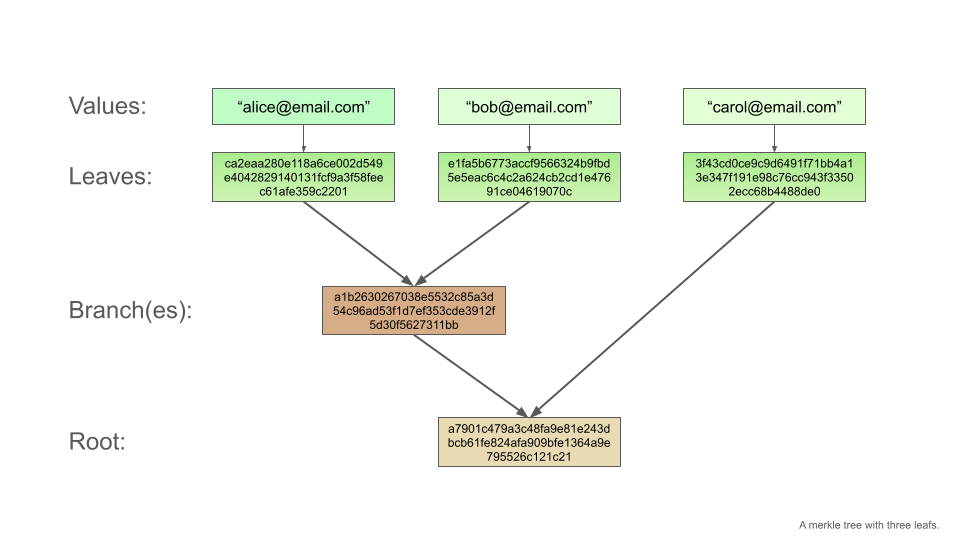

# A practical introduction to Merkle trees

Welcome to our tutorial on Merkle trees! Merkle trees are a fundamental building block of blockchains. They are useful for many different types of decentralized applications. And the best is, they are very easy to use.

In this tutorial, you will build a simple Merkle tree with the [library of Open Zeppelin](https://github.com/OpenZeppelin/merkle-tree) and test it with jest.

At the end of this tutorial:

- You will know how to create a Merkle tree.
- You will understand the concept of Merkle trees, how they are built, and why they are useful.
- You will know how to use proofs to verify leaves.
- You will have had some fun learning a new technology.

### Chapters of this tutorial (table of contents)

1. [Introduction: Why are Merkle trees useful?](#introduction-why-are-merkle-trees-useful)
2. [Build a Merkle tree](#build-a-merkle-tree)
3. [Deepen your understanding with subtrees](#deepen-your-understanding-with-subtrees)
4. [Utilizing Merkle trees to verify data](#utilizing-merkle-trees-to-verify-data)
5. [Usage examples of Merkle trees](#usage-examples-of-merkle-trees)
6. [End and next steps](#end-and-next-steps)

And now, let's get started!

## Introduction: Why are Merkle trees useful?

### Problem: Blockspace is expensive

As a developer new to blockchain technology, you will encounter many new concepts. While the syntax of Solidity looks similar to JS, some programming paradigms are fundamentally different on the blockchain, than on the centralized internet.

One main example is access control and verification. Let's say you'd wanted to grant access to a selected group of users, verified by their email. On a centralized backend, you would store every verified email address in a database. When a user proves she owns an email address (i.e. by clicking on a magic link sent to her email address), you would look up the email address in a database, check if it's verified, and then proceed accordingly.

That does not work on the blockchain.

Why?

- Because storage is very expensive on the blockchain. For every email address that you'd wanted to store on the blockchain, you would have to pay the gas fee for altering the state of the chain.

- Also, depending on the amount of addresses, you may have to use multiple transactions, so you would have to write a routine to make sure all transactions settle.

- And last but not least, every data on a blockchain is public. Different from a centralized backend, you cannot ensure data privacy. Your users don't want to read their email addresses on the blockchain.

Enter Merkle trees. 🦾

### Solution: Merkle trees verify data efficiently and privately

Merkle trees allow you to verify a (theoretically) infinite amount of data by storing only one hash on the blockchain. Also, a user does not need to know the other data points to verify her data, so Merkle trees act as a privacy-enhancing technology.

The general idea of how to create a Merkle tree is: First, you hash a value (i.e. you hash an email address). Then you take the resulting hash, combine it with the hash of another value and hash this combination again. You repeat this procedure until there is only one hash remaining, which is called the "root" of the Merkle tree. A Merkle tree thus consists of the leaves (the hashes of the initial values), the branches (the combinations of hashes), and the root (the final hash) of the Merkle tree.

This sounds complicated now but will become clear once you create your first Merkle tree in the next chapter.

## Build a Merkle tree

### Setup

Please clone this git repository and run `npm install`. Make sure to use a node version >=20.0.0.

### Starting with the whole picture: A tree with three leaves

We will start by creating a Merkle tree with three leaves. This will feel fast at the beginning. Please code along, as we will add more theory later, and you will understand everything fully at the end of this tutorial.

We want to create a Merkle tree with three email addresses.

First, we will create the tree, by creating a file `src/1_first_merkle_tree.ts` with this content:

```ts
import { StandardMerkleTree } from "@openzeppelin/merkle-tree";

// The values are our three email addresses:
const values = [["alice@email.com"], ["bob@email.com"], ["carol@email.com"]];

// The email addresses are of the type string:
const types = ["string"];

// For this tutorial, we have to disable the automatic sorting of the leaves:
const options = { sortLeaves: false };

// With these parameters, we can create the tree:
export const tree = StandardMerkleTree.of(values, types, options);
```

Perfect.

To inspect our tree, we use jest as a testing library. Write this into `test/1_first_merkle_tree.test.ts`:

```ts
import { tree } from "../src/1_first_merkle_tree";

test("1: First Merkle tree", () => {
  console.log("This is the whole tree:\n", tree.render());
  console.log("This is the tree's root:\n", tree.root);

  expect(tree.root).toBe(
    "0xa7901c479a3c48fa9e81e243dbcb61fe824afa909bfe1364a9e795526c121c21"
  );
});
```

You can run this test with `npx jest -t "1: First Merkle tree"`.

You will see this output:

```
PASS  test/1_three_leaves.test.ts
  ● Console

    console.log
      This is the whole tree:
      0) a7901c479a3c48fa9e81e243dbcb61fe824afa909bfe1364a9e795526c121c21
      ├─ 1) a1b2630267038e5532c85a3d54c96ad53f1d7ef353cde3912f5d30f5627311bb
      │  ├─ 3) e1fa5b6773accf9566324b9fbd5e5eac6c4c2a624cb2cd1e47691ce04619070c
      │  └─ 4) ca2eaa280e118a6ce002d549e4042829140131fcf9a3f58feec61afe359c2201
      └─ 2) 3f43cd0ce9c9d6491f71bb4a13e347f191e98c76cc943f33502ecc68b4488de0

      at Object.log (test/1_three_leaves.test.ts:5:13)

    console.log
      This is the tree's root:
      0xa7901c479a3c48fa9e81e243dbcb61fe824afa909bfe1364a9e795526c121c21

      at Object.log (test/1_three_leaves.test.ts:6:13)
```

In this output, you can see the different nodes of the tree. At the top level is the root `0)`, followed by the branches `1)` and leaves `3)` and `4)`. The leaf `2)` does not pair with another hash to form a branch.

Here is another image of our newly created Merkle tree.



You see:

1. The tree gets created with the values.
2. The leaves are the hashes of the values.
3. There is only one branch, which hashes the first two leaves.
4. Finally, the root is a hash of the branch and the third leaf.

Well done.

In the next step, you will learn, how Merkle trees are composed, by creating two subtrees of our Merkle trees.

## Deepen your understanding with subtrees

Let's now have a quick look at two subtrees of our first Merkle tree. You will see, that Merkle trees are simple combinations of hashes.

Start by pasting this code into the file `src/2_subtrees.ts`:

```ts
import { StandardMerkleTree } from "@openzeppelin/merkle-tree";

// To keep this file short, we omit declaring variables and pass values and types directly to the `of` method.

// This tree will only have one leaf:
export const one_leaf_tree = StandardMerkleTree.of(
  [["alice@email.com"]],
  ["string"]
);

// And this tree will have two leaves:
export const two_leaves_tree = StandardMerkleTree.of(
  [["alice@email.com"], ["bob@email.com"]],
  ["string"],
  { sortLeaves: false }
);
```

You created two Merkle trees.

Let's inspect them in a test file `test/2_subtrees.test.ts`:

```ts
import { one_leaf_tree, two_leaves_tree } from "../src/2_subtrees";

test("2: subtrees", () => {
  console.log("This is the one leaf tree:\n", one_leaf_tree.render());
  console.log("This is the two leaves tree:\n", two_leaves_tree.render());

  expect(one_leaf_tree.root).toBe(
    "0xca2eaa280e118a6ce002d549e4042829140131fcf9a3f58feec61afe359c2201"
  );
  expect(two_leaves_tree.root).toBe(
    "0xa1b2630267038e5532c85a3d54c96ad53f1d7ef353cde3912f5d30f5627311bb"
  );
});
```

Run this test with `npx jest -t "2: Subtrees"`. Your console will output this:

```
 PASS  test/2_subtrees.test.ts
  ● Console

    console.log
      This is the tree with one leaf:
       0) ca2eaa280e118a6ce002d549e4042829140131fcf9a3f58feec61afe359c2201

      at Object.log (test/2_subtrees.test.ts:4:11)

    console.log
      This is the tree with two trees:
       0) a1b2630267038e5532c85a3d54c96ad53f1d7ef353cde3912f5d30f5627311bb
      ├─ 1) e1fa5b6773accf9566324b9fbd5e5eac6c4c2a624cb2cd1e47691ce04619070c
      └─ 2) ca2eaa280e118a6ce002d549e4042829140131fcf9a3f58feec61afe359c2201

      at Object.log (test/2_subtrees.test.ts:5:11)
```

As you see, the leaves and hashes of the two subtrees are the same hashes we already know from our first tree with three leaves. This shows, how a Merkle tree is a combination of the hashes of its leaves and branches. Each branch of a tree is the root of a subtree:


> The subtrees in our example require the option _sortLeaves_ to be false. Otherwise, the library will [order the leaves](https://github.com/OpenZeppelin/merkle-tree?tab=readme-ov-file#leaf-ordering) to allow certain functionalities on the blockchain.

Perfect, now you should have a decent understanding of how Merkle trees are created. In the next chapter, you will learn how to use Merkle trees to verify data.

## Utilizing Merkle trees to verify data

In this chapter, you will bring the first Merkle tree with three leaves to action. You will learn about proofs and how to verify data with Merkle trees.

If we would use our Merkle tree in a real-world blockchain application, we would write only the root of the Merkle tree on the chain. Remember, that you can compose a Merkle tree of as many data points as you want, so storing only the root is very efficient.

We now want to verify the user with the email address `alice@email.com`. In order to verify this email address, we need the proof of this leaf. Let's do this in practice.

You don't have to create a new Merkle tree, only create a new test file under `test/3_verification_with_proof.test.ts` with this content:

```ts
import { tree } from "../src/1_three_leaves";

test("3: verification with proof", () => {
  // We can get a proof for a leaf/value like this:
  const proof = tree.getProof(["alice@email.com"]);

  console.log("This is the proof for Alice's email:\n", proof);

  // Now we can verify the proof:
  expect(tree.verify(["alice@email.com"], proof)).toBe(true);
});
```

Run `npx jest -t "3: Verification with proof"` and your console should output:

```
 PASS  test/3_verification_with_proof.test.ts
  ● Console

    console.log
      This is the proof for Alice's email:
       [
        '0xe1fa5b6773accf9566324b9fbd5e5eac6c4c2a624cb2cd1e47691ce04619070c',
        '0x3f43cd0ce9c9d6491f71bb4a13e347f191e98c76cc943f33502ecc68b4488de0'
      ]

      at Object.log (test/3_verification_with_proof.test.ts:7:11)
```

As you see, the test passes. So the last line of our test is enough to verify the data.

Have a look at the proof and compare the entries to your first Merkle tree. You will find, these entries are leaves and branches of your first Merkle tree. You can draw a path from the value `alice@email.com` down to the root. The email address is hashed into its leaf. The leaf is then combined with other hashes on every level. These other hashes are packed together in the proof. The proof of a value thus consists of all other hashes that are necessary to arrive at the Merkle root starting from its leaf.


The combination of our value and the other hashes is sufficient to arrive at the Merkle root. This means, that you can use the proofs to _prove_ that the email is part of this Merkle tree. The proofs don't have to be written on the blockchain, they are only required as an input parameter for verifying a value.

This is how simple it is to use a Merkle tree to verify data.

How would you use a Merkle tree in a real blockchain application?

## Usage examples of Merkle trees

On a blockchain application, you would hand those proofs to your users (or let your frontend do it). The users then have to verify that they own the email address (by clicking on a magic link sent to the email address), and then verify their email address is part of the Merkle root.

Merkle trees are commonly used to implement a whitelist to control access to an NFT mint or token presale.

For this, you would follow these steps:

1. Gather all wallet addresses that you want to whitelist.
2. Create a Merkle tree on a backend. Either store the Merkle tree in memory or store all proofs in a database. You want to be able to access the proofs in a later phase.
3. Store the Merkle root on the blockchain (i.e. in the mint contract or presale contract).
4. Create a frontend, where users can log in with their wallet.
5. Request the proof from the backend via the frontend. The frontend then assembles a transaction including the proof for the user to sign.
6. The user signs this transaction with her wallet and sends it to the blockchain.
7. On the chain, the smart contract checks if the signer of the transaction (_msg.sender_) and the proof are part of the Merkle tree.
8. If yes, the user is whitelisted.

You can learn more about the on-chain part here: [Validation a proof in Solidity](https://github.com/OpenZeppelin/merkle-tree?tab=readme-ov-file#validating-a-proof-in-solidity)

Very well done, you have used a Merkle tree to verify data.

## End and next steps

Congratulations! You successfully finished this tutorial. We hope you had some fun, and learned about Merkle trees and how to use them.

To deepen your knowledge and gain a deeper understanding, we suggest the following steps:

- Create a proof for the email `carol@email.com` from the first Merkle tree. Compare the length of this proof to the length of the proof of `alice@email.com`. Look at the path from this email and compare it to the path of the first email. Can you see, why this proof has a different length?
- How can you hash multiple values? For example an address and an uint (i.e. an allocation of tier)? This is a question specific to the library of Open Zeppelin.
- Duplicate the first Merkle tree and set _sortLeaves_ to _true_. How does the Merkle tree differ from the original one?
- Try to break things. See what happens when you want to verify the wrong value or use the wrong proof. Also, try to get a proof for a non-existent value.
- Try to write a simple smart contract in Solidity to verify your proofs on-chain.

Thanks a lot for following along. We wish you all the best on your exciting journey into web3 technologies.
